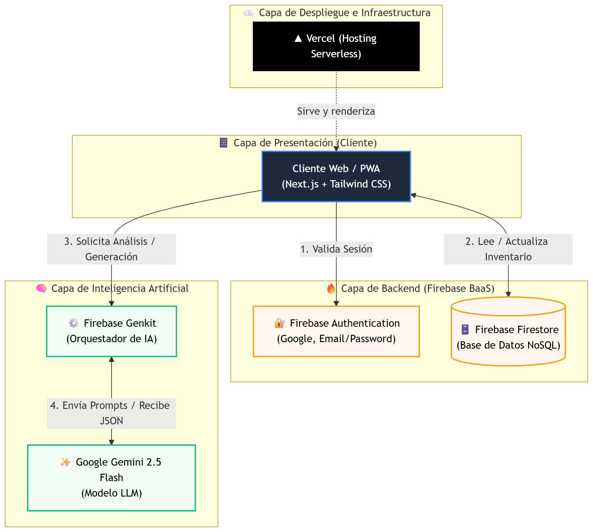
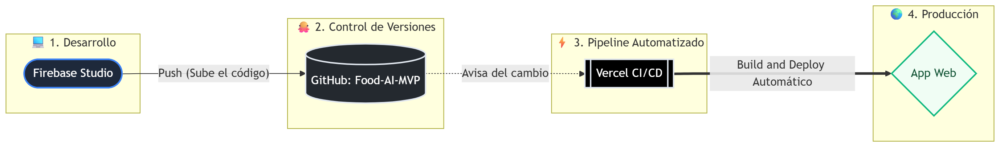

# 🍲 FoodAI - Despensa Inteligente y Evolucionada

FoodAI es una Aplicación Web Progresiva (PWA) diseñada para revolucionar la gestión del hogar. Utiliza Inteligencia Artificial generativa para identificar ingredientes, gestionar tu despensa y crear flujos de experiencia de usuario personalizados.

## 🚀 Características del MVP
* **Autenticación Segura y Sin Fricción:** Integración nativa con Google Auth y Email via Firebase.
* **Gestión de Estado en Tiempo Real:** Base de datos NoSQL para inventario en vivo.
* **Capa de IA Generativa:** Conexión directa con Google Gemini 2.5 Flash a través de Firebase Genkit.
* **UI/UX Premium:** Diseño responsivo con Tailwind CSS y componentes shadcn/ui.

---

## 🏗️ 1. Diagrama de Arquitectura 

La plataforma está diseñada con una arquitectura *Serverless* de alta escalabilidad, separando la capa de presentación de los servicios de backend y el motor de inferencia de IA.

## ⚙️ 2. Flujo de Integración y Despliegue Continuo (CI/CD) 

Para garantizar iteraciones rápidas y estables durante la fase MVP, el proyecto cuenta con un pipeline de automatización completo (GitOps). Todo cambio registrado en el repositorio principal dispara automáticamente una compilación y actualización sin caídas en la red global.

## 🛠️ 3. Instrucciones de Instalación y Ejecución (Reproducibilidad)

Sigue estos pasos para levantar el entorno de desarrollo del MVP de FoodAI en tu máquina local.

### 📋 Requisitos Previos
Para poder ejecutar este proyecto, asegúrate de tener configurado lo siguiente:
* **Node.js** (v18.17 o superior recomendado) y el gestor de paquetes `npm`.
* Un proyecto creado en **Firebase Console** (con Authentication de Google/Email y base de datos Firestore habilitados).
* Una clave API de Gemini generada desde **Google AI Studio**.

### 🚀 Pasos para la ejecución local

**1. Clonar el repositorio**
Abre tu terminal y descarga el código fuente:

git clone [https://github.com/marylinfernandez/Food-AI-MVP.git](https://github.com/marylinfernandez/Food-AI-MVP.git)  
cd Food-AI-MVP

cd food-ai

**2. Instalar las dependencias**
Instala todos los paquetes necesarios del ecosistema de Next.js y Firebase Genkit:

npm install

**3. Configurar las Variables de Entorno**
Crea un archivo llamado .env.local en el directorio raíz del proyecto y añade tus credenciales basándote en este formato:

#### Configuración del Cliente de Firebase
NEXT_PUBLIC_FIREBASE_API_KEY=tu_api_key_aqui

NEXT_PUBLIC_FIREBASE_AUTH_DOMAIN=tu_proyecto.firebaseapp.com

NEXT_PUBLIC_FIREBASE_PROJECT_ID=tu_project_id_aqui

#### Configuración del Motor de IA (Genkit/Gemini)
GEMINI_API_KEY=tu_api_key_de_gemini_aqui

**4. Iniciar los servidores de desarrollo**
Para levantar la interfaz de usuario de Next.js, ejecuta:

npm run dev

La aplicación web estará disponible en 
http://localhost:3000.
